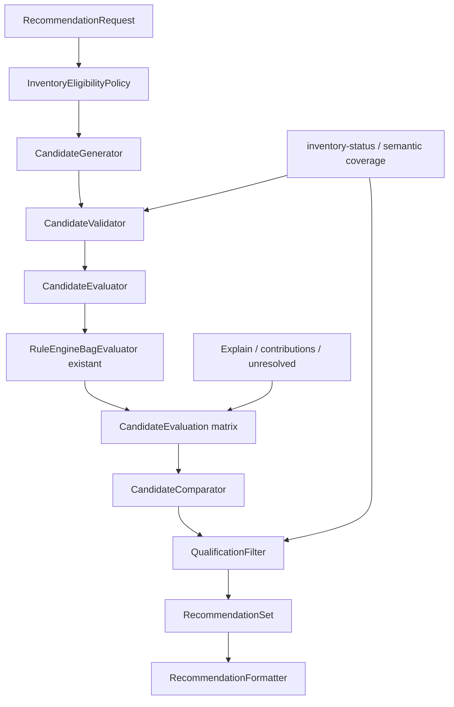

# Architecture du Recommendation Engine

> Spécification d'architecture uniquement. Cette couche consomme le moteur existant sans modifier le Rule Engine, le DSL ni les capacités de club.

## 1. Objectif et frontière de responsabilité

Le Recommendation Engine doit transformer une question utilisateur et un sac de référence en un ensemble de remplacements **évalués, filtrés et expliqués**. Il orchestre le moteur ; il ne réinterprète aucune règle du jeu.

Sa première version couvre uniquement les remplacements unitaires d'un sac de cinq clubs : un club sort, un club possédé et débloqué entre, l'ordre des quatre autres clubs reste inchangé. L'exploration des permutations complètes et des remplacements multiples est différée.

Le produit doit distinguer trois résultats :

1. **candidats recommandables** : évaluation complète avec données suffisantes ;
2. **compromis à examiner** : gains et pertes objectifs, sans vainqueur global ;
3. **candidats exclus ou incomparables** : données, couverture ou contexte insuffisants, avec motifs précis.

Aucun score global n'est calculé. Par défaut, le système utilise une comparaison de dominance métrique par métrique. Si l'utilisateur choisit explicitement une métrique, le système peut ordonner les candidats sur cette seule métrique sans agréger les autres.

## 2. Architecture proposée



Le Recommendation Engine vit dans une couche produit distincte. Sa seule frontière vers le calcul est le protocole existant `BagEvaluator`, dont `RuleEngineBagEvaluator` est l'adaptateur actuel.

### 2.1 RecommendationRequest

Décrit la question posée, sans contenir de logique de jeu.

Informations conceptuelles :

- identifiant du sac de référence ;
- mode de données : `actual` ou `scenario` ;
- niveaux explicites par club ;
- positions autorisées au remplacement, par défaut les cinq ;
- éventuel ensemble de clubs candidats ;
- mode d'évaluation `strict` ou `partial` ;
- objectif de comparaison : `pareto` par défaut ou identifiant d'une métrique explicitement choisie ;
- contraintes produit explicitement demandées, par exemple conserver le type à une position ;
- éventuel contexte de scénario déjà supporté par le moteur.

Le mode `actual` exige les niveaux réels. Le mode `scenario` accepte des niveaux fournis pour l'expérience, mais toute sortie doit être marquée comme hypothétique.

### 2.2 InventoryEligibilityPolicy

Traduit les données utilisateur en périmètre autorisé, sans inférer ce qui manque.

Responsabilités :

- retenir uniquement les entrées explicitement `unlocked: true` ;
- exiger un niveau courant en mode `actual` ;
- accepter une valeur de niveau uniquement si elle est explicitement fournie en mode `scenario` ;
- propager `inventory_complete: false` comme avertissement global ;
- ne jamais interpréter l'absence d'un club dans l'inventaire comme « verrouillé » ;
- appliquer seulement les contraintes de composition validées par le produit.

La première version ne doit pas inventer une obligation de remplacement par même type. Un filtre de type peut être demandé par l'utilisateur, mais ne devient pas une règle du jeu sans validation.

### 2.3 CandidateGenerator

Produit les remplacements unitaires de manière déterministe.

Pour chaque position autorisée et chaque club éligible :

1. retirer le club de cette position ;
2. insérer le candidat à la même position ;
3. conserver l'ordre des autres clubs ;
4. rejeter les doublons dans le sac ;
5. produire un identifiant stable contenant le sac source, la position, le club sortant et le club entrant.

Le générateur ne consulte ni les capacités ni les statistiques. Il ne présélectionne jamais un club parce qu'il semble « meilleur ». Il expose aussi la provenance du candidat afin que la recommandation reste reproductible.

Avec `N` clubs éligibles et un sac de cinq clubs distincts, le nombre maximal de candidats unitaires reste de l'ordre de `5 × N`, avant élimination des clubs déjà présents et des contraintes explicites. Cette taille permet une évaluation exhaustive sans heuristique dans la première version.

### 2.4 CandidateValidator

Vérifie qu'un candidat est techniquement évaluable avant d'appeler le moteur.

Contrôles :

- exactement cinq clubs ;
- aucun doublon ;
- identifiants présents dans le catalogue officiel ;
- niveaux disponibles pour les cinq clubs ;
- niveaux valides dans les tables officielles ;
- club entrant autorisé par l'inventaire et la requête ;
- métadonnées de couverture disponibles.

Les candidats invalides ne disparaissent pas silencieusement : ils deviennent des `ExcludedCandidate` avec un code stable, les données manquantes et une explication lisible.

### 2.5 CandidateEvaluator

Évalue le sac de référence une fois, puis chaque candidat pour les cinq positions courantes en réutilisant `RuleEngineBagEvaluator`.

Pour chaque position, il conserve le `ComparedBag` complet :

- statistiques de base et finales ;
- modificateurs statiques ;
- contributions par capacité ;
- Explain ;
- effets différés planifiés ;
- éléments non résolus ;
- état strict/partial.

La sortie n'est pas une somme des cinq positions, mais une **matrice position × métrique**. Cela évite de compter plusieurs fois un bonus de sac et de prétendre qu'une somme de clubs représente un scénario de jeu réel.

Les évaluations du sac de référence doivent être mises en cache par combinaison `(composition, niveaux, position, mode, contexte)`. La mise en cache est une optimisation de la couche produit ; elle ne modifie pas le résultat du moteur.

### 2.6 CandidateEvaluation

Représente les faits produits pour un candidat :

- remplacement effectué ;
- composition et niveaux ;
- cinq évaluations positionnelles ;
- complétude de chaque position ;
- capacités résolues, ignorées et non résolues ;
- effets différés planifiés ou consommés ;
- avertissements liés aux niveaux, à l'inventaire et au scénario ;
- références vers les entrées Explain ayant produit les contributions.

Les effets Chains planifiés sont conservés séparément. Tant qu'aucune séquence de coups n'est demandée, leur valeur ne doit pas être ajoutée artificiellement aux statistiques d'une autre position.

### 2.7 CandidateComparator

Compare chaque candidat au même sac de référence, cellule par cellule.

Il produit :

- delta de base ;
- delta dû aux capacités ;
- delta final ;
- gain ou perte de modificateur ;
- capacités gagnées, perdues ou devenues non résolues ;
- effets différés gagnés ou perdus ;
- positions améliorées, dégradées, inchangées ou incomparables pour chaque métrique.

Les métriques ne sont jamais additionnées entre elles. Les différences de Power, Control, Spin, angle, rebond ou résistance au vent restent dans leurs unités respectives.

#### Comparaison Pareto sans score

La dominance n'est appliquée qu'aux métriques dont le sens est explicitement défini par leur contrat. Un candidat domine le sac de référence s'il :

- n'est inférieur sur aucune cellule position × métrique qualifiée ;
- est strictement supérieur sur au moins une cellule ;
- ne perd aucune capacité résolue indispensable ;
- ne crée aucun nouvel élément non résolu.

Si le sens d'une métrique n'est pas qualifié, le système affiche seulement sa différence et ne l'utilise pas pour la dominance. Les candidats qui gagnent certaines métriques et en perdent d'autres sont des compromis, pas des vainqueurs.

Pour une demande ciblée, par exemple « maximiser Control », l'ordre peut utiliser uniquement le delta de Control. Toutes les autres pertes restent affichées et aucune préférence implicite n'est ajoutée.

### 2.8 QualificationFilter

Sépare la qualité technique du mérite métrique.

#### Exclusions de la liste recommandable

- niveau absent en mode `actual` ;
- composition invalide ;
- erreur d'évaluation ;
- échec strict ;
- capacité non résolue nouvellement introduite par le remplacement ;
- contexte indispensable absent ;
- métrique demandée indisponible ou non qualifiée.

#### Avertissements non masqués

- inventaire utilisateur incomplet ;
- mode `scenario` avec niveau hypothétique ;
- capacité déjà non résolue dans le sac de référence ;
- effet différé planifié mais non résolu dans l'analyse statique ;
- résultat dépendant d'une seule position ou d'un contexte particulier ;
- candidat non dominé mais comportant des gains et des pertes.

Une politique stricte peut exclure tout candidat incomplet. Une politique exploratoire peut le placer dans la section « incomparable », mais jamais dans les recommandations qualifiées.

### 2.9 RecommendationSet

Contient quatre collections déterministes :

1. `pareto_improvements` : améliorations non dominées et complètes ;
2. `tradeoffs` : au moins un gain et une perte ;
3. `neutral` : aucun changement objectif observé ;
4. `excluded` : candidat non qualifiable, avec motifs.

À l'intérieur d'une collection sans objectif ciblé, l'ordre est stable et non valorisant : position, identifiant du club sortant, identifiant du club entrant. Le nombre de gains ne sert pas de score caché.

Pour une métrique explicitement ciblée, une vue supplémentaire peut ordonner par cette seule métrique. Elle doit conserver les quatre collections et tous les avertissements.

### 2.10 RecommendationFormatter

Produit une sortie CLI et une représentation structurée JSON à partir du même `RecommendationSet`.

Pour chaque remplacement qualifié :

- club sortant, club entrant et position ;
- gains, pertes et valeurs inchangées par position et métrique ;
- contributions de capacités responsables ;
- capacités ajoutées ou retirées ;
- effets différés planifiés ;
- avertissements ;
- raison de la catégorie Pareto, compromis, neutre ou exclue.

La formulation doit être factuelle : « +3 Control à la position 2, −1 Power à la position 4 » plutôt que « meilleur de 12 % ». L'Explain détaillé peut être développé à la demande pour éviter une sortie principale illisible.

## 3. Flux de données

### 3.1 Préparation

```text
UserDataBundle + SavedBag + RecommendationRequest
→ InventoryEligibilityPolicy
→ CandidateGenerator
→ CandidateValidator
```

### 3.2 Évaluation

```text
Baseline et candidats validés
→ cinq BagEvaluationRequest par composition
→ RuleEngineBagEvaluator
→ ComparedBag par position
→ CandidateEvaluation
```

### 3.3 Recommandation

```text
BaselineEvaluation + CandidateEvaluations
→ CandidateComparator
→ QualificationFilter
→ RecommendationSet
→ CLI / JSON
```

Toutes les données calculées par le Rule Engine restent immuables pour la couche de recommandation. Le comparateur dérive uniquement des différences ; il ne modifie jamais les contributions.

## 4. Interaction avec les composants existants

| Composant existant | Réutilisation | Modification requise |
|---|---|---|
| `UserDataBundle` et `Inventory` | Source des clubs débloqués, niveaux, complétude et préférences descriptives | Aucune pour la première version |
| `SavedBag` | Sac de référence | Aucune |
| `BagCandidate` | Composition et niveaux générés | Extension éventuelle hors moteur pour conserver la provenance |
| `BagEvaluator` | Frontière abstraite d'évaluation | Aucune |
| `RuleEngineBagEvaluator` | Évaluation d'une composition à une position | Aucune |
| `ComparedBag` | Statistiques, modificateurs, contributions et effets planifiés | Aucune |
| `ComparableMetric` | Valeurs séparées et unités | Ajouter le sens de comparaison uniquement dans une politique produit validée, pas dans le Rule Engine |
| `inventory-status` | Couverture et raisons d'incomplétude | Lecture ou adaptation en diagnostic de candidat |
| `Explain` | Preuve de chaque contribution | Référencé, jamais réécrit |
| `compare-bags` | Modèle de différences entre deux évaluations | Réutiliser les concepts ; ne pas dépendre de sacs sauvegardés pour les candidats générés |

Le Recommendation Engine ne doit pas appeler directement les registres de mécanismes ou les primitives DSL. Toute évaluation passe par `BagEvaluator`.

## 5. Dépendance aux niveaux utilisateur

Les 20 niveaux actuels sont `null`. En conséquence, la première version en mode `actual` générera correctement les candidats, mais devra tous les exclure avant évaluation avec la raison `missing_user_level`. C'est un comportement attendu et honnête.

Deux parcours doivent rester distincts :

- **recommandation réelle** : niveaux issus de l'inventaire, aucune substitution ;
- **exploration de scénario** : niveaux fournis explicitement, résultat marqué hypothétique dans chaque recommandation.

Un niveau commun implicite est interdit. Un niveau absent ne doit jamais être remplacé par le niveau maximal, Elite ou un niveau moyen.

La complétude de l'inventaire est indépendante des niveaux. Même avec tous les niveaux renseignés, `inventory_complete: false` impose l'avertissement : « recommandations exhaustives uniquement parmi les clubs enregistrés ».

## 6. Vertical slice disponible

La commande actuelle analyse un remplacement fourni explicitement et évalue une seule position :

```text
pga-shootout recommend-replacement <bag_id> <club_sortant> <club_entrant>
    --level LEVEL [--position N] [--strict|--partial] [--json]
```

Sans `--position`, la position du club remplacé est évaluée. Cette commande utilise déjà `RecommendationRequest`, `CandidateValidator`, `CandidateEvaluator`, `CandidateComparator`, `QualificationFilter` et `RecommendationFormatter`. Elle ne génère aucun candidat et ne prétend pas mesurer les effets sur les quatre autres positions.

## 7. Première version exhaustive proposée

Une commande future pourrait suivre ce contrat produit :

```text
pga-shootout recommend-replacements <bag_id> [--position N]
    [--metric power|control|spin|...]
    [--strict|--partial]
    [--scenario-level LEVEL]
```

Sans `--metric`, la sortie présente la frontière Pareto et les compromis. Avec `--metric`, elle ajoute une vue ciblée sur cette seule métrique. `--scenario-level` ne doit jamais être présenté comme le niveau réel du joueur.

La sortie JSON doit être le contrat d'intégration futur ; la sortie texte n'en est qu'un rendu.

## 8. Roadmap d'implémentation

### Lot A — contrats et génération de candidats

- définir les objets conceptuels de requête, remplacement, exclusion et résultat ;
- implémenter `InventoryEligibilityPolicy` ;
- générer exhaustivement les remplacements unitaires ;
- valider composition, doublons, inventaire et niveaux ;
- garantir des identifiants et un ordre reproductibles ;
- tester inventaire incomplet, clubs déjà présents et niveaux absents.

**Valeur produit :** répond immédiatement à « quels remplacements sont autorisés ou impossibles, et pourquoi ? » sans toucher au moteur.

### Lot B — évaluation multi-position

- adapter `RuleEngineBagEvaluator` dans `CandidateEvaluator` ;
- évaluer référence et candidats sur les cinq positions ;
- conserver la matrice de métriques et les contributions ;
- mettre en cache l'évaluation de référence ;
- propager strict/partial, Explain, effets différés et erreurs ;
- créer des golden tests sur les deux sacs de référence.

**Valeur produit :** montre l'effet complet d'un remplacement sur l'ordre du sac, sans agrégation arbitraire.

### Lot C — comparaison et qualification

- calculer les deltas par cellule et par capacité ;
- implémenter les catégories Pareto, compromis, neutre et exclu ;
- qualifier explicitement le sens des métriques utilisables pour la dominance ;
- appliquer les exclusions et avertissements ;
- vérifier qu'aucun score ou somme entre unités n'est introduit.

**Valeur produit :** répond à « quels remplacements valent la peine d'être testés ? » et « quels gains objectifs apportent-ils ? ».

### Lot D — restitution CLI et JSON

- ajouter `recommend-replacements` ;
- produire une sortie synthétique et un détail Explain à la demande ;
- exposer les candidats exclus avec leurs motifs ;
- ajouter des golden tests produit ;
- valider la reproductibilité byte-à-byte du JSON et du texte.

**Valeur produit :** rend l'assistant utilisable sans interface graphique.

### Lot E — objectifs explicites et exploration d'ordre

- ajouter les vues mono-métrique choisies par l'utilisateur ;
- explorer les permutations d'ordre comme une requête distincte ;
- n'ajouter des profils multi-métriques qu'après validation de pondérations explicites ;
- conserver la frontière Pareto comme sortie sans pondération.

**Valeur produit :** permet de répondre progressivement à « améliore le plus Control » ou « quel ordre évite de perdre Power ? », sans transformer ces objectifs en préférence universelle.

## 9. Stratégie de tests

Chaque lot doit vérifier :

- génération exhaustive et sans doublon ;
- respect de l'inventaire et des niveaux ;
- ordre stable des candidats ;
- identité exacte entre une évaluation directe et celle orchestrée ;
- cinq positions évaluées sans double comptage ;
- contributions gagnées/perdues correctement attribuées ;
- exclusion de tout nouveau résultat non résolu en politique stricte ;
- conservation des avertissements en partial ;
- non-utilisation des métriques non qualifiées dans la dominance ;
- cas Pareto, compromis, neutre et incomparable ;
- golden tests CLI/JSON sur les sacs de référence ;
- absence de modification des golden tests du Rule Engine.

## 10. Risques et protections

| Risque | Protection architecturale |
|---|---|
| Niveaux réels absents | Exclusion en mode `actual`, scénario explicitement étiqueté |
| Inventaire incomplet | Avertissement global permanent, aucune prétention d'exhaustivité |
| Score caché via nombre de gains | Catégories Pareto et ordre stable non valorisant |
| Unités additionnées arbitrairement | Matrice de métriques séparées, aucune somme inter-métriques |
| Sens d'une métrique non validé | Différence affichée mais métrique exclue de la dominance |
| Double comptage des bonus de sac | Résultats conservés par position, pas de somme naïve |
| Capacité non simulée introduite par un candidat | Exclusion stricte ou section incomparable en exploration |
| Effet Chains sous-évalué | Effet planifié affiché séparément, jamais converti en bonus statique implicite |
| Explosion combinatoire future | V1 limitée aux remplacements unitaires ; cache de la référence |
| Recommandation dépendante du terrain ou de la physique | Contexte absent signalé ; aucun substitut inventé |
| Divergence entre CLI et API | Un `RecommendationSet` structuré unique alimente les deux rendus |

## 11. Décision d'architecture

La première version peut être construite sans changer le Rule Engine. Les composants à créer appartiennent tous à l'orchestration produit : génération, validation, évaluation multi-position, comparaison, qualification et rendu.

Le résultat attendu n'est pas « le meilleur club » au sens universel, mais une réponse plus rigoureuse :

- les remplacements qui améliorent objectivement le sac sans perte qualifiée ;
- les compromis et leurs gains/pertes exacts ;
- les candidats impossibles à comparer et la donnée manquante ;
- une vue ciblée lorsqu'un objectif mono-métrique est explicitement choisi.

Cette architecture transforme le moteur actuel en assistant de recommandation explicable tout en conservant ses garanties : calcul piloté par les données, contributions traçables, modes strict/partial et absence d'hypothèse silencieuse.
